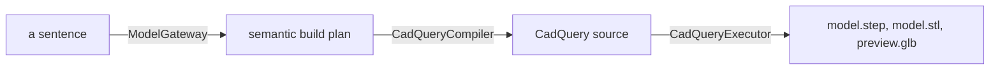

# AI CAD

AI CAD is a planner-first local prototype for single-part parametric modeling.
It turns a design brief into a visible semantic build plan, compiles that plan
into deterministic CadQuery source, and runs that source to export STEP, STL
and a GLB for the browser preview.



## What a Run Looks Like

One command from the repo root, with the environment from
[Quick Start](#quick-start) in place. This is the real output, trimmed only
where it says `...`:

```
$ ./aic "a mug 86 mm across and 96 mm tall"
AI CAD
================================================================================
a mug 86 mm across and 96 mm tall

Planner: rule-based-local-fallback (local, local)
Planning risk: 0.25

Warnings
--------------------------------------------------------------------------------
- Supported geometry runtime is Python 3.11 via Miniforge/conda + mamba. Local
  builds may fail outside that environment.
- Local Ollama planner unavailable, falling back: Ollama planner request failed:
  Client error '404 Not Found' for url 'http://127.0.0.1:11434/api/chat' For
  more information check:
  https://developer.mozilla.org/en-US/docs/Web/HTTP/Status/404
- Using the deterministic rule-based planner.

Summary
--------------------------------------------------------------------------------
Create the outer body, hollow it, and attach a handle so the mug emerges in
stages.

Assumptions
--------------------------------------------------------------------------------
- Every dimension in this plan is in millimetres.
- Request did not state wall thickness, so category defaults were applied.
- Handle is blocky and revision-friendly rather than ergonomic in v1.

Steps
--------------------------------------------------------------------------------
1. Create the outer mug body as a cylinder.
   id: create_outer_body
   macro: create_mug_body
   workplane: XY
   location:
   - Start a sketch on the Top or XY plane.
   - Place the outer circle center at the global origin.
   sizes:
   - Outer diameter = 86 mm.
   - Extrude height = 96 mm.
   sketch_constraints:
   - Constrain the circle center coincident with the origin.
   - Apply one diameter dimension of 86 mm so the sketch is fully defined.
   manual_recipe:
   - Sketch one centered circle for the mug exterior.
   - Extrude the profile upward by 96 mm as a new solid.
   parameters:
   - outer_diameter: 86.0
   - height: 96.0
   postcondition: Outer cylinder exists with target height and outer diameter.

...
```

Two more steps follow: the shell, and the handle sketched on the YZ plane.

The Ollama warning in the middle is the deterministic fallback announcing
itself. Ollama was running on the machine that produced this, but `llama3.1:8b`
was never pulled, so the planner call 404s and the rule-based planner writes the
plan instead. That is the default path until you pull a model, and every line
above is the fallback's own work.

Ask for something the macro library has no recipe for and it says so rather
than pretending:

```
$ ./aic "a teapot which can hold 1 gallon"
...
- Using the deterministic rule-based planner, but no macro family matches this
  shape, so the plan below is a stand-in.

Summary
--------------------------------------------------------------------------------
No macro family matches this request. As a stand-in, create the cap body first,
then add perimeter grip cutouts as the finishing step.

Assumptions
--------------------------------------------------------------------------------
- Every dimension in this plan is in millimetres.
- No macro family matches "a teapot which can hold 1 gallon", so the steps below
  build a bottle cap instead of the object described.
- The macro library covers mug, L bracket, project box, phone stand and bottle
  cap.
- Request did not state diameter, height and wall thickness, so category
  defaults were applied.
...
```

The steps it hands back are still a real bottle cap, workplanes and sketch
constraints and all, so the plan remains usable as a manual CAD recipe. It just
will not call one a teapot.

## Status

This is a prototype. The front of the pipeline is covered by tests; the far end
has never met a real CadQuery.

Planning, compilation and revision are the tested part. In `backend/`,
`python -m pytest -q` runs 319 tests and they pass. The frontend has 14 vitest
tests across `src/api.test.ts` and `src/previewCache.test.ts`, and both
`npm run lint` and `npm run build` are clean. Nothing in the frontend suite
renders a component: that needs React Three Fiber, a WebGL context and a
backend answering.

Geometry is the gap. CadQuery is conda-only and is not installed on the machine
this was developed on, so every test that reaches the executor runs against
[backend/tests/stub_cadquery.py](backend/tests/stub_cadquery.py), a stand-in
that records the calls the compiled source makes and rejects any length that is
not finite and positive. That is enough to show the compiler emits source that
runs, in the right order, with sane numbers. It is not evidence that a real
CadQuery build succeeds, and nobody has run one, so the STEP/STL/GLB export and
the browser preview are unverified rather than working or broken.

`frontend/src-tauri/` is 661 lines of Rust for the desktop shell and has not
been built or verified in this working copy, because there is no Rust toolchain
here. `npm run tauri:dev` and the packaging flow in
[docs/windows-desktop.md](docs/windows-desktop.md) are written, not tested.

[.github/workflows/ci.yml](.github/workflows/ci.yml) lints, format-checks and
tests both halves. Every lint, format, test and build step in it has been run by
hand locally and passes. It has never run on GitHub, which is why there is no
badge at the top of this file.

## Supported Runtime

The supported CAD runtime is `Python 3.11 + Miniforge/conda + mamba`.

Important:

- Do not install CadQuery with `pip` for this project.
- Python `3.13+` is unsupported by CadQuery's `pip` package.
- This repo treats anything except `Python 3.11 + conda/mamba` as unsupported
  for geometry execution, even though non-CAD backend logic may still run.

See [docs/setup.md](docs/setup.md) for the exact environment bootstrap steps.

## Quick Start

Fastest terminal test, once the environment from
[environment.yml](environment.yml) is created and activated:

```bash
./aic "a mug 86 mm across and 96 mm tall"
```

That runs the planner directly in the terminal with no web app startup. Run
outside that environment it prints the bootstrap commands and exits 1 rather
than a traceback. With no prompt at all, `./aic` opens an interactive loop and
plans one prompt per line until you press Enter on an empty one.

If a `.venv-test/` directory exists at the repo root, `./aic` uses its
interpreter instead of the `python3` on PATH, and the Tauri dev shell picks it
up too (after `AI_CAD_DEV_PYTHON`, ahead of `.venv/`). That is the escape hatch
for planning without conda: the planner, the API and the compiler are plain
Python, and only the geometry build needs CadQuery. The directory is gitignored.

1. Create the supported CAD environment from [environment.yml](environment.yml).
2. Install frontend dependencies:

```bash
cd frontend
npm install
```

3. Start the backend for local web testing:

```bash
cd backend
python -m uvicorn app.main:app --reload --port 8000
```

4. Start the frontend:

```bash
cd frontend
npm run dev
```

By default the backend runs in trusted local mode and uses a local Ollama
planner for every prompt, including simple shapes like mugs. The default model
is `llama3.1:8b`, and the planner timeout is intentionally generous so the
model has time to think through the steps.

If Ollama is unavailable or the planner call fails, the backend falls back to
the deterministic local planner. Hosted models remain blocked unless a healthy
containerized executor is configured.

To use the local AI planner, make sure Ollama is running locally and the model
exists:

```bash
ollama list
ollama serve
```

## What the Planner Covers

Geometry comes from a fixed macro library with five families modelled end to
end: mug, L bracket, project box, phone stand and bottle cap. Whatever the
prompt leaves out, the plan states: which dimension it guessed at, which one it
clamped to keep the solid buildable, which fell back to a category default, and
whether the shape you asked for is in the library at all.

- [docs/planner-coverage.md](docs/planner-coverage.md) has the five families in
  full and exactly how a prompt is read for dimensions and units.
- [docs/revisions.md](docs/revisions.md) has what the revision box will change
  on an existing plan and what it refuses to guess at.

## Project Layout

- `backend/`: FastAPI API, planner/compiler/executor pipeline, runtime storage
- `frontend/`: React + Vite app with prompt, plan, code, and 3D preview panes
- `frontend/src-tauri/`: Windows-first desktop shell and backend bootstrap manager
- `scripts/`: `aic_tui.py`, the terminal front end `./aic` runs
- `docs/`: setup, architecture, and the planner reference
- `packaging/`: runtime manifest and Windows packaging scripts

The pipeline itself is walked module by module in
[docs/architecture.md](docs/architecture.md).

## Desktop App Base

The repo now includes a Tauri desktop shell for a Windows-first packaged app.

Developer loop:

```bash
cd frontend
npm install
npm run tauri:dev
```

Packaged Windows notes live in [docs/windows-desktop.md](docs/windows-desktop.md).

## License

MIT. See [LICENSE](LICENSE).
