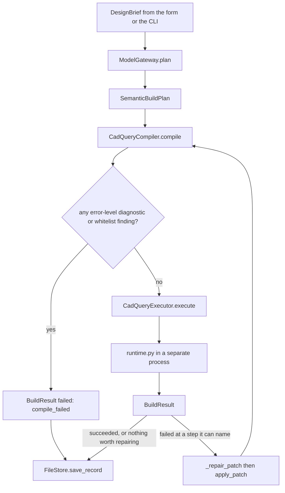

# Architecture

One sentence goes in and a solid comes out, but not in one step. The request
crosses four boundaries on the way, and each one hands the next a data structure
rather than a string: a brief becomes a `SemanticBuildPlan`, the plan becomes
deterministic CadQuery source, the source runs in a separate process, and that
process writes back a `BuildResult`. Every one of those is a pydantic model in
[backend/app/models/schemas.py](../backend/app/models/schemas.py), which is why
you can read any single stage without holding the other three in your head.

This document walks the pipeline in the order a request travels it. Line numbers
appear where they save you a search; they will drift, the names will not.

That is `DesignService.build`, and the loop back through the compiler runs at
most three times.

## The API surface

[backend/app/api/routes_designs.py](../backend/app/api/routes_designs.py) is
eighty-one lines and holds five endpoints, all of them prefixed `/designs`. Each one
is a thin call into `DesignService`; the routes do argument checking and nothing
else.

`POST /designs/plan` plans, saves a record, and returns the plan with the
planner's warnings attached. `POST /designs/compile` takes a plan and returns
source: it is the only stateless endpoint, storing nothing and issuing no id.
`POST /designs/build` plans, compiles, and executes in one call. `POST
/designs/revise` takes a design id and one English instruction. `GET
/designs/{id}/artifacts/{kind}` serves a file for one of the four kinds in
`ARTIFACT_KINDS` in `design_service.py`: `glb`, `stl`, `step_export`,
`source`.

There is a wrinkle worth knowing before you read the frontend. Plan and build
each mint their own design id, so the web app's Plan button and its Build button
do not produce two views of one design: `handleBuild` in
[frontend/src/App.tsx](../frontend/src/App.tsx) replans from the brief and gets a
fresh id back. Revision is the only endpoint that operates on an existing
record.

`GET /health` lives in [backend/app/main.py](../backend/app/main.py) rather than
the designs router, and it does more than answer 200. It reports the Python
version, the runtime root, the containerized executor's health, and a probe of
the local Ollama planner. That probe is an HTTP round trip with a five-second
ceiling, and both the web app and the Tauri shell poll `/health` on a timer, so
the result is cached behind `LOCAL_PLANNER_PROBE_TTL_SECONDS` (`main.py:38`).
The TTL is 15 seconds against a 10-second poll on purpose, and the comment above
it says why: a TTL under the poll interval expires between every pair of polls
and the cache never gets used at all. The cost is noticing a restarted Ollama up
to fifteen seconds late.

## Choosing a planner

[backend/app/services/gateway/model_gateway.py](../backend/app/services/gateway/model_gateway.py)
owns the decision of who writes the plan, and it is a ladder with three rungs.

The first rung is the local model. `plan()` tries
[ollama_planner.py](../backend/app/services/planners/ollama_planner.py) when
`prefer_local_model_planner` is on and an Ollama planner was wired up
(`model_gateway.py:57`). That planner asks Ollama for JSON constrained to a
schema derived from `SemanticBuildPlan`, fills in the fields the model left
blank, and hands back the plan plus a `ModelCallRecord` naming the model. If
Ollama is not running, or is running without the configured model, or answers
with something that will not validate, the call raises `OllamaPlannerError` and
the gateway writes the reason into the response warnings and drops to the next
rung.

The second rung is hosted Gemini, and in a default checkout it is unreachable.
`_can_use_hosted` (line 165) needs `allow_hosted_models` on, an API key present,
*and* `executor_health().healthy` true, and `executor_health` returns unhealthy
outright unless `executor_mode` is `containerized` (line 129). The shipped
defaults in [settings.py](../backend/app/core/settings.py) are
`allow_hosted_models = False`, `executor_mode = "local"`, and no key, so nothing
you can do in a `.env` alone opens that gate. The code is there and it is
tested, but out of the box the ladder skips it.

The third rung is
[rule_based_planner.py](../backend/app/services/planners/rule_based_planner.py),
which cannot fail. It always returns a plan, so the pipeline always has
something to compile.

The gateway also decides which fallback sentence to print, and it asks the
fallback planner itself rather than keeping a second keyword list
(`_supports_rule_based_fallback`, line 109). A duplicate list had already
drifted once and reported "capacitor mount" as a supported shape.

## Planning

The rule-based planner reads dimensions out of the prompt with a set of
regexes, infers a macro family from the nouns in it, and asks
[cadquery_macros.py](../backend/app/services/cadquery_macros.py) for the steps
that family is built from. Five families are modelled end to end and the
fallback for anything else is `bottle_cap` (`rule_based_planner.py:156`), with
the plan's summary and assumptions saying plainly that no family matched and the
steps are a stand-in.

The dimension scan is the fiddliest code in the repo and it has its own
document: see [planner-coverage.md](planner-coverage.md) for which word orders
read, what happens to a radius, and what the plan owns up to in its assumptions.

What matters here is the shape of what comes out. A `SemanticBuildPlan` is a
summary, a list of assumptions, a flat parameter dictionary, and an ordered list
of `SemanticStep`s. Each step names a macro, carries the parameters that macro
needs, and also carries the things a macro cannot express: a workplane, location
notes, size notes, sketch constraints, manual instructions, and a postcondition.
Nothing downstream reads that second half, and it is the reason the project
works at all on a machine without CadQuery: it makes the plan stand on its own
as a recipe a person can follow by hand in Onshape. On most machines that is
what you get, so it had better be good.

`cadquery_macros.py` holds twelve macros, each a lambda that formats a template
string into a Python function body. `macro_parameter_names` (line 141) works out
which keys a macro reads by running its template against a dict subclass that
records every lookup, rather than keeping a hand-written list beside it. The
same derived catalog is what the local planner's prompt shows the model
([prompt_engineering.py](../backend/app/services/planners/prompt_engineering.py)),
so the model is told the exact parameter spellings the compiler will demand.

## Compiling

[cadquery_compiler.py](../backend/app/services/compilers/cadquery_compiler.py)
turns the plan into a module: one Python function per step, plus an
`export_artifacts` helper and a `build_model` driver that threads a `state`
value through the step functions.

The compile is deterministic. Nothing here calls a model, and the same plan
always produces byte-identical source. Most of the file is the checking, and the
checks exist because each of them is a way a plan can produce source that
compiles and then dies:

A step id has to be a Python identifier that is not a keyword, is not one of the
four names the module already owns (`RESERVED_STEP_IDS`, line 28), and has not
been used by an earlier step. The duplicate check compares NFKC-normalized
names, because Python normalizes identifiers as it parses them and two visibly
different ids can bind the same name.

Parameters are coerced to numbers, but only the ones the macro's template
actually reads (`_clean_parameters`, line 333). A planner tagging a step with
`"material": "PLA"` has not made a build error and the plan is not refused over
it. A quoted `"86 mm"` is unwrapped to 86; an infinity is rejected, because
`repr(inf)` is `inf`, which is an undefined name in the generated module.

`build_model` calls the steps in dependency order rather than the order the plan
listed them (`_call_order`, line 262). This exists for the local model, which
will happily put a hollow before the body it hollows; the compiled module ran
and died on `'NoneType' object has no attribute 'faces'`. Plan order is the
tie-break, so a plan already in dependency order emits exactly the source it
used to. A cycle is an error and the plan is refused by name. A `depends_on`
entry naming a step this plan did not compile is only a warning and the edge is
dropped.

`manual_feature` is the planner's escape hatch. It compiles to `return state`, a
pass-through, and a warning diagnostic naming the step, so a plan with one
unmodellable feature still builds the rest of itself.

The emitted source then goes through
[source_validator.py](../backend/app/services/validation/source_validator.py),
which parses it and walks the AST against an allowlist. The import whitelist is
one entry, `cadquery`; `from`-imports are refused outright; anything outside
`ALLOWED_NODES` is a warning. Read its docstring before you trust it for
anything: it says, and means, that it is a lint check and not a sandbox
boundary. Its real job is catching a macro that started emitting something the
library was never meant to emit.

`DesignService._compile_has_blockers` treats any error-level diagnostic or any
error-level whitelist finding as fatal, and the build stops there with a
`FailureReport` rather than handing bad source to a subprocess.

## Executing

This is where the honesty section starts.

[cadquery_executor.py](../backend/app/services/executors/cadquery_executor.py)
does not run the compiled source. It writes it to
`<artifacts>/compiled.py`, writes a JSON payload beside it naming every path the
run needs, deletes any stale `executor-result.json`, and then invokes
[runtime.py](../backend/app/services/executors/runtime.py) as
`python -m app.services.executors.runtime <payload.json>` with a timeout.
Whatever the subprocess prints goes into `executor-stderr.log`, appended rather
than truncated, because repair attempts reuse the same directory.

The boundary is a crash and timeout boundary, not a security one. It is the same
interpreter, invoked through `sys.executable`. What it buys is that a segfault
inside OpenCascade, a run that never terminates, or a Python that cannot start
at all comes back as a `BuildResult` carrying a `FailureReport`, never as an
exception for FastAPI to turn into a 500. There are three of those failure
shapes, one for each way the subprocess can fail to answer, and each names what
to do next.

Inside the subprocess, `runtime.py` execs the compiled module, then calls the
step functions one at a time rather than calling `build_model`, so it can cache
each step's output. It reaches the same order the compiler did by using the same
`order_by_dependencies` helper
([plan_order.py](../backend/app/services/plan_order.py)); if those two orders
ever diverged, the program the user is reading would not be the program that
ran. After the last step it calls `export_artifacts` for STEP, STL and GLB, then
measures the solid: `isValid()` through OCC's shape checker, a non-zero volume,
the GLB and STEP files present on disk, and, when the brief stated a height, the
measured height within ten percent of it or 1 mm, whichever is looser. All of
them have to pass for the status to be `succeeded`.

The first thing `runtime.py` does is try to import CadQuery, and here is the
part that matters. CadQuery is a conda-only dependency and is not installed by
`pip`. Without it, `_load_cadquery` returns None and the run ends immediately
with a `cadquery_unavailable` failure pointing at
[environment.yml](../environment.yml). Planning, compilation, the API, the
revision engine and the CLI all work fine without it; only geometry does not.

**No real geometry has ever been built from this repo on any machine that has
touched it.** The test suite drives `runtime.py`'s step loop, cache, export and
failure paths against
[backend/tests/stub_cadquery.py](../backend/tests/stub_cadquery.py) and a second
stub defined inline in `tests/test_executor.py`. Those stubs record every
chained call and refuse any length that is not finite and positive, which is a
genuinely useful thing to test against: `box(0.1 - (0.1 * 2), ...)` is source
this library really did emit once. But they compute nothing. `Volume()` and
`BoundingBox()` return fixed numbers. Every claim in this document about what
CadQuery does with the emitted source is a claim about source that has been run
against a stand-in.

## What lands on disk

[file_store.py](../backend/app/services/storage/file_store.py) is the
per-design half. Under `backend/runtime/designs/<design_id>/` you get
`record.json`, which is a full `DesignRecord` (brief, plan, and where they
exist the compile result, build result, revision intent and patch), and an
`artifacts/` directory holding `compiled.py`, `executor-payload.json`,
`executor-result.json`, `executor-stderr.log`, and on a successful build
`model.step`, `model.stl` and `preview.glb`.

`runtime/` outlives the code that wrote it, and every schema in this project is
a `StrictModel` with `extra="forbid"`, so a record written by an older build
fails validation. `load_record` treats that, and a truncated file, as "no record
here" and returns None, which the routes turn into a 404. It used to be a 500.

[cache_store.py](../backend/app/services/storage/cache_store.py) is the
per-step half, and it is what makes a revision cheap. Each entry is one STEP
export of one step at one set of parameters, keyed by a hash over the design id,
the step id, a hash of that step's parameters, the *parent* step's cache key,
and the compiler version. Chaining the parent key in is what makes the key
describe a whole prefix of the build rather than one isolated step: change
something early and every key after it changes too. Entries live in
`backend/runtime/cache/<key>/` as `entry.json` plus the artifact, and the whole
root is held under a 256 MB budget, pruned oldest-first by directory mtime after
every save.

Nothing in the cache is precious. A miss costs the CadQuery time to rebuild one
step, so an entry that will not parse is treated as a miss rather than an
error - it used to raise from inside the subprocess at a point where the runtime
had already named the step it was working on, which blamed a step that was fine.

## Revising, and rebuilding from the dirty step

[revision_engine.py](../backend/app/services/revision/revision_engine.py) reads
one instruction and produces a `RevisionIntent` carrying a confidence score and
the evidence behind it, plus a `PlanPatch` when it is confident enough to write
one. `DesignService.revise` then gates on that score: under 0.60 it asks for
clarification, under 0.80 it asks for confirmation, and a topology change or a
missing patch stops it at the same place. Only above 0.80 does anything get
rebuilt. The full account of what it accepts and what it declines, and why the
declines are the interesting part, is in [revisions.md](revisions.md).

When a revision does go through, `DesignService._earliest_dirty_step`
finds the first step in plan order that the patch touches, and that id rides
along into the executor as `dirty_from_step`. `runtime.py` serves every step
before it from cache and rebuilds from there on. So changing a mug's wall
thickness reuses the cached outer body and rebuilds only the shell and the
handle.

The same machinery drives automatic repair. When a build fails at a step the
executor can name, `_repair_patch` shrinks the parameters the failure
message implicated, or every repairable length in the step if it named none, by
ten percent, and tries again. Three attempts means at most two shrinks actually
reach the executor, which still leaves the part 19 percent smaller than asked
for, and that is why `_note_repairs` writes the change into the build result
instead of letting a quietly resized part pass as a success. One detail is worth reading the code for: the patch
targets every step that carries the same parameter name, not just the failed
one, because a project box carries its width in both `create_project_box_shell`
and `add_standoffs`, and patching one would leave the standoffs positioned for a
box that no longer exists.

## The contract between the two halves

[schemas.py](../backend/app/models/schemas.py) is 216 lines and is the whole
API contract. Everything derives from `StrictModel`, which forbids unknown
fields, so a stale record, a plan from an older compiler, or a model inventing a
key is a validation error at the boundary rather than a `KeyError` three
functions deep.

[frontend/src/types.ts](../frontend/src/types.ts) mirrors it by hand. There is
no generator: the file is written to match, and the two drift if you let them.
When you add a field to a response model, that is the other file to open.

## Where the desktop shell fits

`frontend/src-tauri/` is a Rust shell whose job is to own the runtime rather
than the UI: unpack a bundled Python, start uvicorn, poll `/health`, and hand
the React app a base URL through
[frontend/src/desktop.ts](../frontend/src/desktop.ts), which falls back to
plain browser mode when `__TAURI_INTERNALS__` is absent from `window`. The crate
has not been built or verified in this working copy; there is no Rust toolchain
available here. See
[windows-desktop.md](windows-desktop.md), which says the same thing at greater
length.

## How far the tests reach

`cd backend && python -m pytest -q` runs 319 tests and they pass. That number is
not evenly spread over the pipeline, and it is worth knowing where it is thick
and where it is thin.

Thick: the dimension scan and the macro families, the gateway's ladder and its
quota and health bookkeeping, the compiler's diagnostics and ordering, the
revision engine's accept and decline paths, and the cache key and prune logic.
Those are pure functions over data structures and the tests assert real
behaviour on them.

Thin, and honestly so: everything past the CadQuery import. The executor's
failure paths are covered because they do not need CadQuery, and the runtime's
step loop is covered against a stub. Geometry itself is not covered by anything,
because nothing here has ever produced any.

## Reading order

If you are opening this repo for the first time, the shortest path to
understanding it is
[schemas.py](../backend/app/models/schemas.py), then
[design_service.py](../backend/app/services/design_service.py), then
[cadquery_compiler.py](../backend/app/services/compilers/cadquery_compiler.py).
Those three carry the design. Setup instructions are in [setup.md](setup.md).
